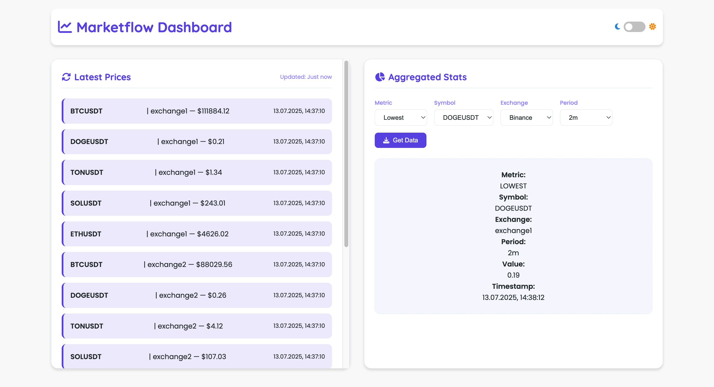
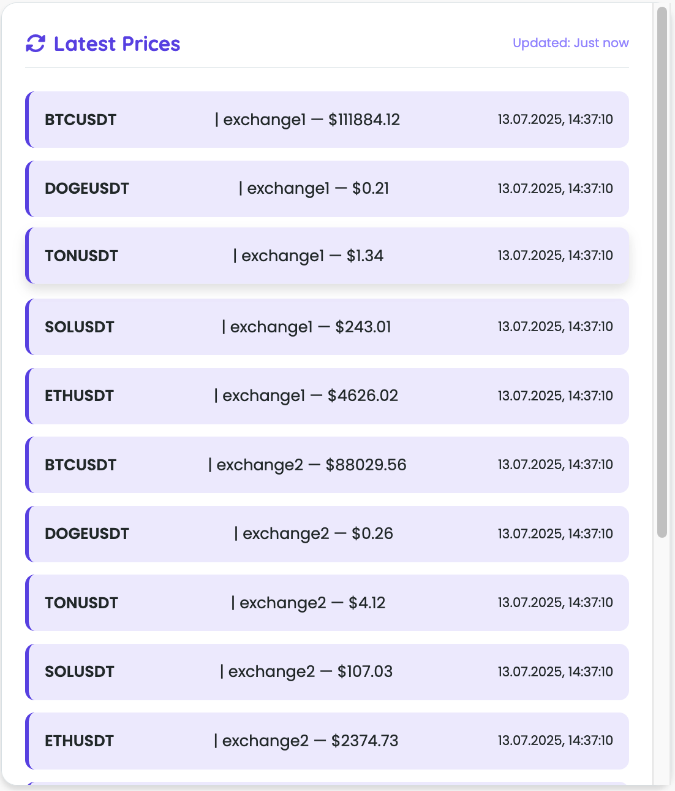
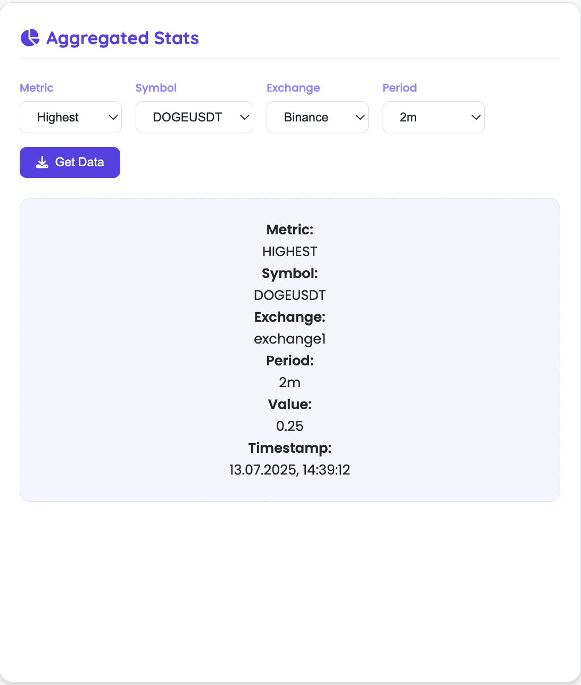
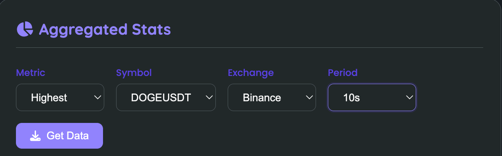

# MarketFlow — Real-Time Cryptocurrency Market Tracker

MarketFlow is a high-performance backend system with a modern lightweight dashboard that processes and visualizes real-time cryptocurrency market data using Go, Redis, PostgreSQL, and a vanilla JS frontend.


---

## Overview

MarketFlow collects cryptocurrency price data from multiple exchanges, aggregates it, caches it, and makes it accessible via a REST API. A beautiful built-in frontend lets users view real-time prices.

### Features
- Clean **Hexagonal Architecture**
- Real-Time & Historical **Price Stats**
- Supports **Live/Test Mode** switching via API
- Uses **Redis** for real-time cache and **PostgreSQL** for aggregates
- Built-in **Vanilla HTML/CSS/JS Frontend**
- Dockerized and easy to run

---

## Dashboard Screenshots

### Light Mode

<p float="left">
  
  
  
</p>

### Dark Mode

<p float="left">
  
  
</p>

### Theme toggle
<p float="left">
  
</p>


---

## ⚙️ Installation

### Prerequisites
- Go 1.22+
- Docker

### Load Exchange Images (Live Mode Only)
```bash
docker load -i exchanges/exchange1_amd64.tar
docker load -i exchanges/exchange2_amd64.tar
docker load -i exchanges/exchange3_amd64.tar
````

### Running the App

```bash
git clone https://github.com/Temutjin2k/marketflow.git
cd marketflow
docker-compose up --build
```

---

## API Reference

| Endpoint                                  | Description                  |
| ----------------------------------------- | ---------------------------- |
| `GET /prices/latest/{symbol}`             | Get latest cached price      |
| `GET /prices/latest/{exchange}/{symbol}`  | Latest by exchange           |
| `GET /prices/highest/{symbol}`            | Max price in default period  |
| `GET /prices/highest/{exchange}/{symbol}` | Max by exchange              |
| `GET /prices/lowest/{symbol}`             | Min price in period          |
| `GET /prices/average/{symbol}`            | Average price                |
| `POST /mode/test`                         | Switch to test mode          |
| `POST /mode/live`                         | Switch to live mode          |
| `GET /health`                             | Health check of all services |

> Aggregated endpoints support `?period=1m`, `2m`, `30s` (1s-5m).

---

## Postman Collection

You can find a ready-to-use Postman collection inside the `api/` directory:

```
api/marketflow.postman_collection.json
```

Import this collection into Postman to quickly test all available endpoints including switching modes, fetching price stats, and running health checks.

---

## Frontend Features

* Real-time price stream from Redis
* Filter by exchange/symbol/metric/period
* Theme toggle: 🌞 Light & 🌚 Dark
* Simple vanilla HTML/CSS/JS

---

## Authors

* **Meruyert** — Database, API, frontend ✨
* **Temutjin** — System architecture, service design, worker pools ⚙️

---

> “Concurrency is not parallelism — but with MarketFlow, you'll master both.”
